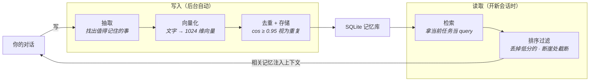
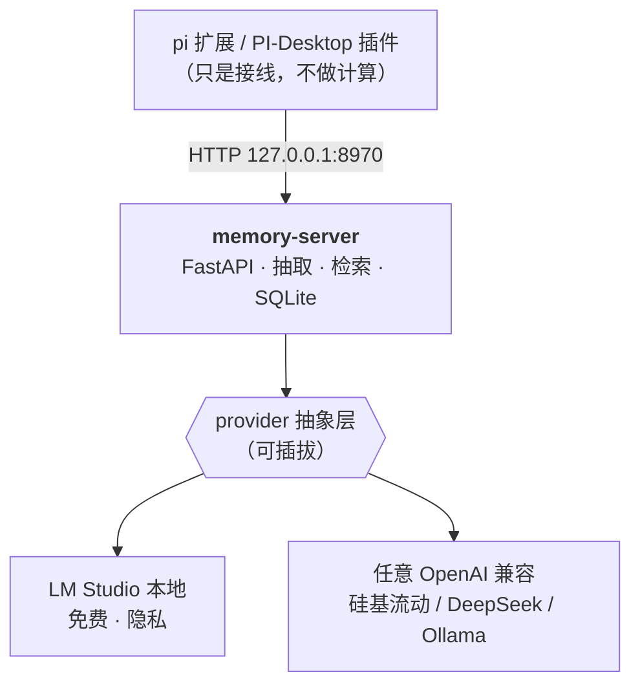

# pi 记忆中心

> 给你的 AI 助手接一个**跨会话的长期记忆**——你说过的偏好、定过的事、踩过的坑，它下次还记得。

---

## 它解决什么问题

你现在每次开新会话，AI 都是从零开始：

- 你说过"回答我用中文"——下次它又飚英文
- 你讲了半小时的业务背景——换个窗口就得再讲一遍
- 你上周定的技术方案——这周它又提了个完全相反的
- 你踩过的坑、总结的经验——散在几十个会话里，永远找不回来

**根本原因**：AI 的上下文是易失的，会话结束就清空。你不会每次都重新介绍自己的同事，但你的 AI 每次都像个新来的。

## 装完之后是什么效果

```
你:  以后回答我都用中文，别写英文。
              ↓  (后台自动抽取，你不必做任何事)
记忆库: [偏好] 用户偏好用中文回答

━━━━━━ 三天后，新会话，你已经忘了说过这话 ━━━━━━

你:  帮我写个 README。
              ↓  (自动语义检索 + 注入上下文)
AI:  好的。(它已经知道你要中文了)
```

**你会得到：**

| | |
|---|---|
| **自动的** | 不用手动记。每轮对话后台自动抽取"值得记住的东西" |
| **能搜的** | 不是关键词匹配，是**语义**检索。"怎么优化速度"能搜到"性能调优"那条 |
| **有分类的** | `fact` 事实 / `preference` 偏好 / `goal` 目标 / `decision` 决定 / `knowledge` 知识 |
| **全本地的** | 用本地方案时，一个字都不出你的电脑 |
| **不会重复的** | 语义去重，同一件事不会存八遍 |
| **自己会活** | 模型崩了自动拉起，服务挂了自动重启 |

**实测数据**（我自己的实例）：387 条记忆，全部 1024 维，检索 top 相似度稳定在 0.64~0.80。

---

## 它是怎么工作的

**写**：每轮对话后，后台把对话交给抽取模型 —— 「这里面有什么事值得以后记住？」→ 变成向量存起来。
**读**：新会话时，把当前任务也变成向量 → 找出**距离最近**的几条 → 就是语义最相关的旧记忆。



**为什么用向量而不是关键词？** 因为你问「怎么让它别老崩」时，记忆里存的是「服务稳定性加固」——一个词都对不上，但意思是一回事。向量能抓住这个。

**一句话**：写的时候把文字变成向量存起来，读的时候把问题也变成向量，找**向量距离最近**的几条 → 就是语义最相关的记忆。

**为什么用向量而不是关键词？** 因为你问"怎么让它别老崩"时，记忆里存的是"服务稳定性加固"——一个词都对不上，但意思是一回事。向量能抓住这个。

### 技术栈怎么搭



**关键设计：推理后端是可插拔的。** 本地 LM Studio 和云端 API 走同一个抽象层，改一行配置就能切。想用本地就本地，想省钱/换机器就换云端。

---

## 开始用

```bash
git clone <repo> && cd pi-web-extensions/memory-server
./install.sh
```

`install.sh` 会自动找 Python、建虚拟环境、装依赖，然后跑一个**交互式向导**：它会探测你机器上有什么（LM Studio / Ollama / 云端），把可用模型列出来让你选，实测维度，验证连通性，最后写好配置。

### 两条路，任选

| | **A：本地模型** | **B：云端 API** |
|---|---|---|
| 成本 | 免费 | 很便宜 |
| 隐私 | ✅ 全在本地 | ❌ 上传到服务商 |
| 硬件 | 需 ~8GB 内存 | 无要求 |
| 适合 | Mac / 在意隐私 | 5 分钟跑起来 |

**A**：装 [LM Studio](https://lmstudio.ai) → 启动它的服务（`127.0.0.1:1234`）→ 下两个模型 → 跑 `./install.sh`

**B**：跑 `./install.sh` → 向导里选"云端" → 选服务商 → 填 Key

### 启动

```bash
nohup ./run.sh &                                    # 后台常驻
curl -s http://127.0.0.1:8970/api/health            # 看到 ok:true 就成了
```

---

## 选模型（唯一需要动脑的地方）

向导会问你两次，这两个模型的选法**完全不同**：

### 向量化模型 —— 决定"能不能搜到"

| 模型 | 中文 | 说明 |
|---|---|---|
| **`bge-m3`** (1024维) | ⭐⭐⭐⭐⭐ | **中文首选**，开源最强多语言向量模型之一 |
| `nomic-embed-text` (768维) | ⭐⭐ | 轻量，但**中文区分度差**——中文句全挤在 0.99，检索基本失效 |
| `text-embedding-3-small` | ⭐⭐⭐⭐ | OpenAI，质量好，要付费 |

> ⚠️ **中文场景别用英文向模型**，这是最常见的翻车原因。

### 抽取模型 —— 决定"记得准不准"

**它每条对话都要跑一次，所以成本敏感。**

| | |
|---|---|
| ✅ 本地 7B 小模型 | 免费、隐私、质量足够 |
| ✅ DeepSeek 这类便宜云模型 | 几分钱 |
| ❌ GPT-4 / Claude Opus | **账单会爆炸** |

### ⚠️ 换向量模型的铁律

换模型后**已有记忆全部失效**（新旧向量不在同一坐标系），必须重建索引：

```bash
.venv/bin/python reembed.py
```

服务启动时会自动检测维度不匹配并告警。另外去重阈值要跟着重标：`bge-m3` → `0.95`，`nomic` → `0.88`。

---

## 接到你的工具上

引擎跑起来后，选一个前端：

<details>
<summary><b>pi CLI 扩展</b>（4 个工具 + 3 个钩子 + /memory 命令）</summary>

```bash
ln -s "$(pwd)/memory-extension/index.ts" ~/.pi/agent/extensions/memory.ts
```
然后在 pi 里 `/reload`。用软链是为了改源码立即生效。
</details>

<details>
<summary><b>PI-Desktop 插件</b>（单一 Memory 工具，action 分派）</summary>

```bash
cd pi-memory && pi-plugin pack .     # → dist/local.pi-memory-<ver>.piplug
```
在 PI-Desktop 里安装这个文件。支持 `recall` / `search` / `remember` / `extract` / `list` / `forget` / `status`。
</details>

---

## 目录

```
memory-server/       记忆引擎（核心，必需）
├── providers.py     推理后端抽象层 ← 双后端的关键
├── app.py           FastAPI 服务 + 全部端点
├── extractor.py     抽取   embedder.py   向量化
├── retrieval.py     检索   store.py      SQLite
├── stability.py     模型自愈守护
├── setup.py         交互向导
├── install.sh       一键安装
└── run.sh           守护启动器

memory-extension/    pi CLI 前端
pi-memory/           PI-Desktop 前端
tts-server/          语音合成（独立组件）
wal-extension/       其他扩展（独立组件）
```

---

## 常见问题

<details><summary><b>服务起不来 / 端口被占用</b></summary>

```bash
lsof -tiTCP:8970 -sTCP:LISTEN | xargs -r kill -9 && nohup ./run.sh &
```
</details>

<details><summary><b>macOS 报 <code>pydantic_core</code> 架构不匹配</b></summary>

系统 Python 是 x86_64 混编但机器是 arm64。加 `arch -arm64` 前缀。`install.sh` 和 `run.sh` 已自动处理。
</details>

<details><summary><b>检索结果很差 / 搜不到</b></summary>

按顺序排查：
1. 向量模型是不是英文向的？（`nomic` 做中文）→ 换 `bge-m3`
2. 维度匹配吗？看 `/api/health` 或启动日志
3. 换过模型但没跑 `reembed.py`？
4. 历史对话没处理过？→ `backfill.py`
</details>

<details><summary><b>报 502 / 连接被劫持</b></summary>

系统代理把 `127.0.0.1` 也代理走了。代码已强制 `trust_env=False`，自己写脚本调用时记得同样处理。
</details>

<details><summary><b>模型被卸载（<code>Model is unloaded</code>）</b></summary>

引擎自带守护线程，每 60 秒巡检、自动拉起。若还反复掉，把 `ttl_seconds` 设为 `0`（常驻）。

历史踩坑：`ttl_seconds: 3600` 和 LM Studio 全局 `jitModelTTL`（1 小时）同时到期，导致每小时模型被卸了又拉。
</details>

<details><summary><b>抽取返回空 / 拿不到 JSON</b></summary>

`max_tokens` 给小了。reasoning 型模型需要 `3000` 以上。
</details>

---

## 维护

```bash
./run.sh                    # 前台（崩溃自动重启）
nohup ./run.sh &            # 后台常驻
.venv/bin/python reembed.py # 重建索引（换向量模型后必须）
.venv/bin/python backfill.py --min-chars 150 --chunk 12   # 补处理历史对话
./install.sh                # 重新配置（自动备份旧配置）
```

---

## 为什么这样设计

**为什么不用 AI 工具自带的模型配置？**
自带的通常是你的主力模型，很贵。但**抽取是每轮对话都要跑的**——聊天是"一问一答"，抽取是"每轮后台都跑"，量级差很多。而且抽取只是信息分类，小模型足够。所以独立配置，但支持任意 OpenAI 兼容端点。

**为什么 LM Studio 是"第一公民"？**
它是唯一提供模型生命周期管理的（加载/常驻/自动拉起）——纯 API 端点没这能力。用云端时守护线程自动关闭，不做无用探测。

## License

MIT
