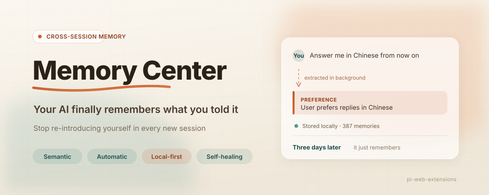
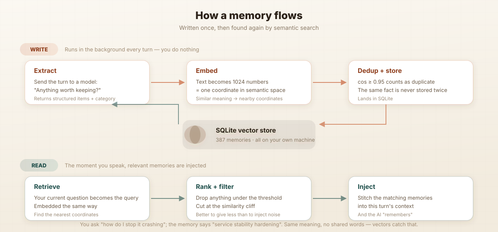
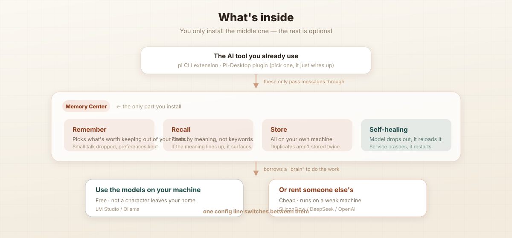

# Memory Center

[English](README.md) · [中文](README.zh-CN.md)



---

## Have you felt this?

Last week you told it: *"answer me in Chinese from now on."* It complied.
Today you open a new session and ask it to write a README — **it replies in English.**

You say it again. It agrees again.
Next week, the exact same thing happens again.

You spent half an hour explaining your business context last week. New window this week — it's blank.
You settled on a technical approach last month. This month it proposes the opposite.

**It's not you forgetting. It's that it has no memory.**
The moment a conversation ends, it's wiped. You don't re-introduce yourself to a colleague every morning — but your AI meets you like a stranger, every time.

---

## After you install it

Left is today, right is after — **the same sentence, two different experiences.**

- Say it once, it's remembered — **you do nothing**
- Three days later it recalls it on its own, not one word repeated
- Not keyword matching: you ask *"how do I stop it crashing"*, it surfaces the *"service stability hardening"* memory you saved
- Zero friction: it runs quietly in the background and never interrupts your conversation

---

## What actually gets smoother

| | Before | After |
|---|---|---|
| **Preferences** | Every new session, say "in Chinese" / "be concise" / "give me code" again | Said once, remembered forever |
| **Context** | You explain your background for half an hour; a new window resets it | It retrieves it itself — you never explain twice |
| **Decisions** | You settled it last week; this week it flips | It remembers *why* you decided, so it stops flip-flopping |
| **Lessons** | Pitfalls you hit are scattered across dozens of sessions, unfindable | They resurface when relevant — like notes you always carry |
| **Search** | If Ctrl+F can't find it, it's gone | Similar *meaning* is enough — not one word needs to match |
| **Upkeep** | You have to remember to save things and tag them | Fully automatic, you're not involved |

**This is not chat-log search.** A chat log is dead — you need to know the keyword and roughly when it happened to dig it out.
Memory is alive: at the moment you speak, the relevant entries are pulled into context automatically. **You won't even notice it working.**

---

## How fast is setup

### Option A: npm (one command)

```bash
pi install npm:pi-memory
```

The postinstall script finds Python, creates a virtualenv, installs dependencies, then runs an **interactive wizard**: it probes what's on your machine (LM Studio / Ollama / cloud), lists the available models for you to pick, measures the real embedding dimension, verifies connectivity, and writes the config.

The npm package ships the pi extension + skills. The **engine** (a Python service) lives in the [main repo](https://github.com/MoeWang-ys/pi-web-extensions) — the postinstall script locates it if you already cloned it, and tells you the clone command if you haven't.

Then start the engine (the script prints the exact path):

```bash
cd <engine-dir> && nohup ./run.sh &
```

### Option B: from source

```bash
git clone https://github.com/MoeWang-ys/pi-web-extensions.git
cd pi-web-extensions/memory-server
./install.sh
```

### Two paths, pick one

| | **A: Local models** | **B: Cloud API** |
|---|---|---|
| Cost | Free | Very cheap |
| Privacy | ✅ Stays on your machine | ❌ Uploaded to the provider |
| Hardware | ~8GB RAM for models | None |
| Best for | Macs, privacy-minded | Running in 5 minutes |

**A**: Install [LM Studio](https://lmstudio.ai) → start its server → download two models → `./install.sh`
**B**: `./install.sh` → choose "cloud" in the wizard → pick a provider → paste your key

Or skip the key in the file entirely and use environment variables (recommended — keeps secrets out of config):

```bash
export MEMORY_EMBEDDING_API_KEY="sk-xxx"
export MEMORY_EXTRACT_API_KEY="sk-xxx"
```

---

## Choosing models (the only part that needs thought)

The wizard asks you twice. These two models are chosen in **completely different** ways.

### Embedding model — decides whether search works at all

| Model | Chinese | Notes |
|---|---|---|
| **`bge-m3`** (1024-dim) | ⭐⭐⭐⭐⭐ | **Best for Chinese**. One of the strongest open multilingual embedding models |
| `nomic-embed-text` (768-dim) | ⭐⭐ | Lightweight, but **poor Chinese discrimination** — Chinese sentences all collapse into 0.99 similarity and retrieval effectively fails |
| `text-embedding-3-small` | ⭐⭐⭐⭐ | OpenAI, good quality, paid |

> ⚠️ **Don't use an English-oriented model for Chinese.** This is the single most common failure.

### Extraction model — decides how *accurately* it remembers

**It runs on every single turn, so cost matters.**

| | |
|---|---|
| ✅ A local 7B model | Free, private, good enough |
| ✅ A cheap cloud model (DeepSeek etc.) | Fractions of a cent |
| ❌ GPT-4 / Claude Opus | **Your bill will explode** |

### ⚠️ The iron rule when changing embedding models

Change the model and **all existing memories become invalid** (old and new vectors don't live in the same coordinate space). You must rebuild the index:

```bash
.venv/bin/python reembed.py
```

The service checks for dimension mismatches on startup and warns you. The dedup threshold must also be recalibrated: `bge-m3` → `0.95`, `nomic` → `0.88`.

---

## Connecting to your tools

Once the engine is running, pick a frontend:

<details>
<summary><b>pi CLI extension</b> (4 tools + 3 hooks + a <code>/memory</code> command)</summary>

```bash
ln -s "$(pwd)/memory-extension/index.ts" ~/.pi/agent/extensions/memory.ts
```
Then `/reload` inside pi. Symlink rather than copy, so source edits take effect immediately.
</details>

<details>
<summary><b>PI-Desktop plugin</b> (single <code>Memory</code> tool, dispatched by <code>action</code>)</summary>

```bash
cd pi-memory && pi-plugin pack .     # → dist/local.pi-memory-<ver>.piplug
```
Install that file in PI-Desktop. Supports `recall` / `search` / `remember` / `extract` / `list` / `forget` / `status`.
</details>

---

## How it works



**Write**: after each turn, the conversation goes to an extraction model — "anything here worth remembering later?" → becomes a vector, gets stored.
**Read**: on a new session, your current task becomes a vector too → the **nearest** few are found → those are the semantically relevant memories.

**Why vectors and not keywords?** You ask "how do I stop it crashing" while the memory says "service stability hardening" — not one word matches, but they mean the same thing. Vectors catch that.



**The key design: the inference backend is pluggable.** Local LM Studio and cloud APIs sit behind the same abstraction layer — one line of config switches between them.

---

## Layout

```
memory-server/       the engine (core, required)
├── providers.py     inference backend abstraction ← the dual-backend key
├── app.py           FastAPI service + all endpoints
├── extractor.py     extraction    embedder.py    embedding
├── retrieval.py     retrieval     store.py       SQLite
├── stability.py     model self-healing daemon
├── setup.py         interactive wizard
├── install.sh       one-command install
└── run.sh           watchdog launcher

memory-extension/    pi CLI frontend
pi-memory/           PI-Desktop frontend
tts-server/          text-to-speech (standalone)
wal-extension/       other extensions (standalone)
```

---

## FAQ

<details><summary><b>Service won't start / port already in use</b></summary>

```bash
lsof -tiTCP:8970 -sTCP:LISTEN | xargs -r kill -9 && nohup ./run.sh &
```
</details>

<details><summary><b>macOS: <code>pydantic_core</code> architecture mismatch</b></summary>

Your system Python is x86_64 but the machine is arm64. Prefix with `arch -arm64`. Both `install.sh` and `run.sh` handle this automatically.
</details>

<details><summary><b>Retrieval is bad / nothing is found</b></summary>

In order:
1. Is your embedding model English-oriented? (`nomic` for Chinese) → switch to `bge-m3`
2. Do the dimensions match? Check `/api/health` or the startup log
3. Changed models without running `reembed.py`?
4. Never processed your history? → `backfill.py`
</details>

<details><summary><b>502 / connections being hijacked</b></summary>

A system proxy is routing `127.0.0.1` too. The code forces `trust_env=False`; do the same if you write your own client.
</details>

<details><summary><b><code>Model is unloaded</code></b></summary>

A self-healing daemon polls every 60s and reloads it. If it still flaps, set `ttl_seconds` to `0` (resident).

Past incident: `ttl_seconds: 3600` and LM Studio's global `jitModelTTL` (1 hour) expired together, so the model was unloaded and reloaded every hour.
</details>

<details><summary><b>Extraction returns empty / no JSON</b></summary>

`max_tokens` is too small. Reasoning models need `3000`+ or the JSON gets truncated.
</details>

---

## Maintenance

```bash
./run.sh                    # foreground (auto-restart on crash)
nohup ./run.sh &            # background, persistent
.venv/bin/python reembed.py # rebuild index (required after changing embedding model)
.venv/bin/python backfill.py --min-chars 150 --chunk 12   # process conversation history
./install.sh                # reconfigure (backs up the old config)
```

---

## Design notes

**Why not reuse the AI tool's own model config?**
That's usually your flagship model — expensive. But **extraction runs on every turn**: chatting is "ask once, answer once", extraction is "runs in the background every turn". Different order of magnitude. And extraction is just information classification — a small model is plenty. So it's a separate config, but it supports any OpenAI-compatible endpoint.

**Why is LM Studio a "first-class citizen"?**
It's the only backend offering model lifecycle management (load / keep resident / auto-reload) — a bare API endpoint can't do that. Under a cloud provider the watchdog daemon shuts itself off rather than doing pointless probing.

## License

MIT
