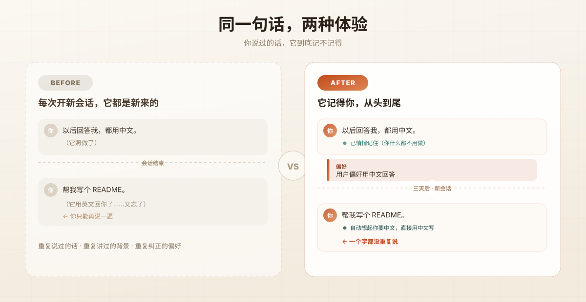
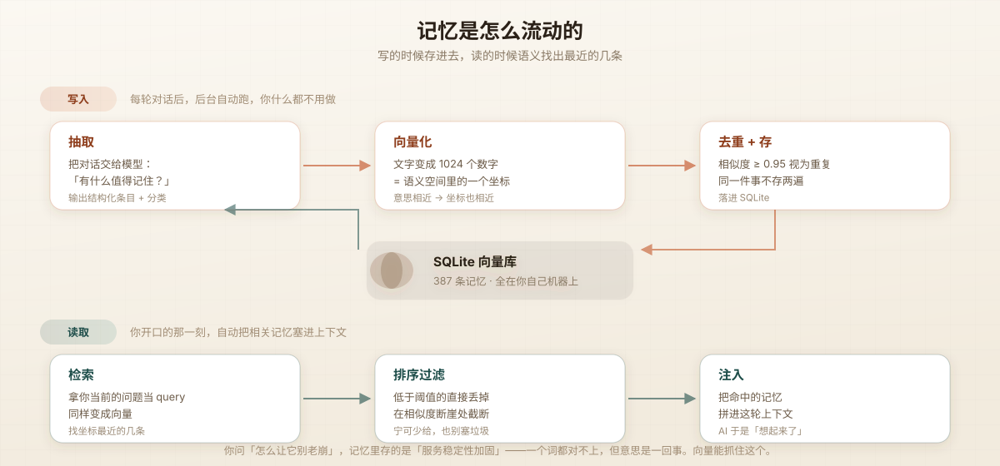
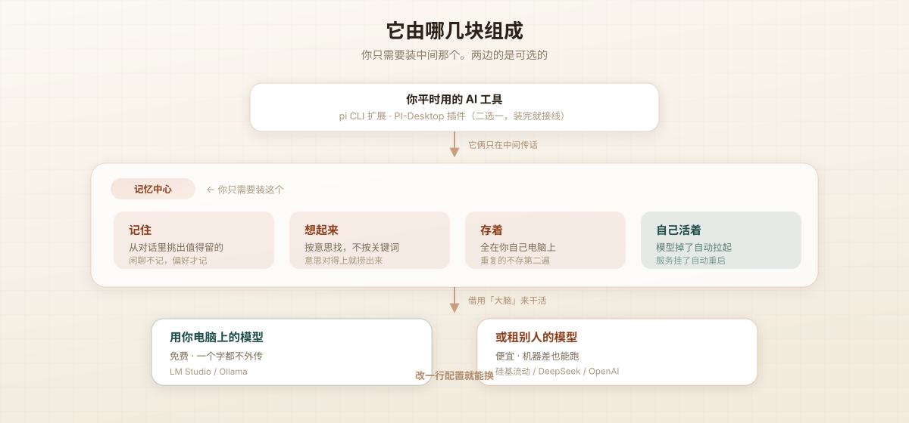

# pi 记忆中心

[English](README.md) · [中文](README.zh-CN.md)



---

## 你有没有过这种感觉

上周你跟它说「以后回答我都用中文」。它照做了。
今天开个新会话，你问它写个 README —— **它用英文回你。**

你又讲了一遍。它又答应了。
下周，同样的事再发生一遍。

你上周花半小时给它讲清了业务背景，这周换了个窗口，它一脸茫然。
你上个月跟它定好的技术方案，这个月它提了个完全相反的。

**不是你记性差，是它没有记性。**
每次对话一结束，它就清空了。你不会每天早上重新介绍自己给同事，但你的 AI 每次见你都像第一次。

---

## 装上之后

左边是现在，右边是装上之后 —— **同一句话，两种体验。**

- 你说一遍，它就记住了 —— **你什么都不用做**
- 三天后它自己想起来，一个字都不用你重复
- 不是关键词匹配：你问「怎么让它别老崩」，它能想起你存过的「服务稳定性加固」
- 全程不打扰你：后台悄悄跑，不在对话里冒任何东西出来

---

## 具体丝滑在哪

| 场景 | 以前 | 现在 |
|---|---|---|
| **偏好** | 每开一个新会话，都要重新说一遍「用中文」「别啰嗦」「给代码」 | 说一次，以后都记得 |
| **背景** | 讲完半小时业务背景，换个窗口等于没讲 | 它自己检索出来，你不用再讲 |
| **决定** | 上周定的方案，这周它又推翻 | 记得你为什么这么定，不会反复横跳 |
| **经验** | 踩过的坑散在几十个会话里，永远找不回来 | 需要时自动浮现，等于随身带着笔记 |
| **检索** | Ctrl+F 找不到就真找不到了 | 意思相近就能搜到，一个词对不上也没关系 |
| **维护** | 得记得手动存、手动分类 | 全自动，你不参与 |

**它不是聊天记录搜索**。聊天记录是死的，你得知道关键词、知道大概什么时候说的，才能翻出来。
记忆是活的——它在你说这句话的当下，自动把相关的那几条塞进上下文。**你甚至不会意识到它在工作。**

---

## 装起来有多快

### 方式 A：npm（一条命令）

```bash
pi install npm:pi-memory
```

postinstall 脚本会自己找 Python、建虚拟环境、装依赖，然后跑一个**交互式向导**：探测你机器上有什么（LM Studio / Ollama / 云端），把能用的模型列出来让你选，实测维度、验证连通，最后写好配置。

npm 包里是 pi 扩展。**引擎**（Python 服务）在主仓库里 —— postinstall 脚本会自动找到你克隆的引擎目录，没找到就告诉你克隆命令。

然后启动引擎（脚本会打印确切路径）：

```bash
cd <引擎目录> && nohup ./run.sh &
```

### 方式 B：从源码

```bash
git clone https://github.com/MoeWang-ys/pi-memory.git
cd pi-memory/memory-server
./install.sh
```

### 两条路，任选

| | **A：本地模型** | **B：云端 API** |
|---|---|---|
| 成本 | 免费 | 很便宜 |
| 隐私 | ✅ 全在你电脑上 | ❌ 会上传到服务商 |
| 硬件 | 需要 ~8GB 内存 | 无要求 |
| 适合 | Mac、在意隐私 | 5 分钟就想跑起来 |

**A**：装 [LM Studio](https://lmstudio.ai) → 启动它的服务 → 下两个模型 → `./install.sh`
**B**：`./install.sh` → 向导里选"云端" → 选服务商 → 填 Key

不填 Key 也行，用环境变量（推荐，密钥不进配置文件）：

```bash
export MEMORY_EMBEDDING_API_KEY="sk-xxx"
export MEMORY_EXTRACT_API_KEY="sk-xxx"
```

---

## 选模型（唯一需要动脑的地方）

向导会问你两次，这两个模型的选法**完全不同**。

### 向量化模型 —— 决定"能不能搜到"

| 模型 | 中文 | 说明 |
|---|---|---|
| **`bge-m3`**（1024 维） | ⭐⭐⭐⭐⭐ | **中文首选**，开源最强多语言向量模型之一 |
| `nomic-embed-text`（768 维） | ⭐⭐ | 轻量，但**中文区分度差**——中文句子全挤在 0.99 相似度，检索基本失效 |
| `text-embedding-3-small` | ⭐⭐⭐⭐ | OpenAI 的，质量好，要付费 |

> ⚠️ **中文场景别用英文向模型**，这是最常见的翻车原因。

### 抽取模型 —— 决定"记得准不准"

**它每条对话都要跑一次，所以成本敏感。**

| | |
|---|---|
| ✅ 本地 7B 小模型 | 免费、隐私、质量足够 |
| ✅ DeepSeek 这类便宜云模型 | 几分钱 |
| ❌ GPT-4 / Claude Opus | **账单会爆炸** |

### ⚠️ 换向量模型的铁律

换模型后**已有记忆全部失效**（新旧向量不在同一个坐标系），必须重建索引：

```bash
.venv/bin/python reembed.py
```

服务启动时会自动检测维度不匹配并告警。去重阈值也要跟着重标：`bge-m3` → `0.95`，`nomic` → `0.88`。

---

## 接到你的工具上

引擎跑起来后，选一个前端：

<details>
<summary><b>pi CLI 扩展</b>（4 个工具 + 3 个钩子 + <code>/memory</code> 命令）</summary>

```bash
ln -s "$(pwd)/memory-extension/index.ts" ~/.pi/agent/extensions/memory.ts
```
然后在 pi 里 `/reload`。用软链是为了改源码立即生效。
</details>

<details>
<summary><b>PI-Desktop 插件</b>（单一 <code>Memory</code> 工具，action 分派）</summary>

```bash
cd pi-memory && pi-plugin pack .     # → dist/local.pi-memory-<ver>.piplug
```
在 PI-Desktop 里安装这个文件。支持 `recall` / `search` / `remember` / `extract` / `list` / `forget` / `status`。
</details>

---

## 它是怎么做到的



**写**：每轮对话后，后台把对话交给抽取模型 —— 「这里面有什么事值得以后记住？」→ 变成向量存起来。
**读**：新会话时，把当前任务也变成向量 → 找出**距离最近**的几条 → 就是语义最相关的旧记忆。

**为什么用向量而不是关键词？** 因为你问「怎么让它别老崩」时，记忆里存的是「服务稳定性加固」——一个词都对不上，但意思是一回事。向量能抓住这个。



**关键设计：推理后端是可插拔的。** 本地 LM Studio 和云端 API 走同一个抽象层，改一行配置就能切。

---

## 目录

```
memory-server/       记忆引擎（核心，必需）
├── providers.py     推理后端抽象层 ← 双后端的关键
├── app.py           FastAPI 服务 + 全部端点
├── extractor.py     抽取   embedder.py   向量化
├── retrieval.py     检索   store.py      SQLite
├── stability.py     模型自愈守护
├── setup.py         交互向导
├── install.sh       一键安装
└── run.sh           守护启动器

memory-extension/    pi CLI 前端
pi-memory/           PI-Desktop 前端
```

---

## 常见问题

<details><summary><b>服务起不来 / 端口被占用</b></summary>

```bash
lsof -tiTCP:8970 -sTCP:LISTEN | xargs -r kill -9 && nohup ./run.sh &
```
</details>

<details><summary><b>macOS 报 <code>pydantic_core</code> 架构不匹配</b></summary>

系统 Python 是 x86_64 混编但机器是 arm64。加 `arch -arm64` 前缀。`install.sh` 和 `run.sh` 已自动处理。
</details>

<details><summary><b>检索结果很差 / 搜不到</b></summary>

按顺序排查：
1. 向量模型是不是英文向的？（`nomic` 做中文）→ 换 `bge-m3`
2. 维度匹配吗？看 `/api/health` 或启动日志
3. 换过模型但没跑 `reembed.py`？
4. 历史对话没处理过？→ `backfill.py`
</details>

<details><summary><b>报 502 / 连接被劫持</b></summary>

系统代理把 `127.0.0.1` 也代理走了。代码已强制 `trust_env=False`，自己写脚本调用时记得同样处理。
</details>

<details><summary><b>模型被卸载（<code>Model is unloaded</code>）</b></summary>

引擎自带守护线程，每 60 秒巡检、自动拉起。若还反复掉，把 `ttl_seconds` 设为 `0`（常驻）。

历史踩坑：`ttl_seconds: 3600` 和 LM Studio 全局 `jitModelTTL`（1 小时）同时到期，导致每小时模型被卸了又拉。
</details>

<details><summary><b>抽取返回空 / 拿不到 JSON</b></summary>

`max_tokens` 给小了。reasoning 型模型需要 `3000` 以上。
</details>

---

## 维护

```bash
./run.sh                    # 前台（崩溃自动重启）
nohup ./run.sh &            # 后台常驻
.venv/bin/python reembed.py # 重建索引（换向量模型后必须）
.venv/bin/python backfill.py --min-chars 150 --chunk 12   # 补处理历史对话
./install.sh                # 重新配置（自动备份旧配置）
```

---

## 为什么这样设计

**为什么不用 AI 工具自带的模型配置？**
自带的通常是你的主力模型，很贵。但**抽取是每轮对话都要跑的**——聊天是"一问一答"，抽取是"每轮后台都跑"，量级差很多。而且抽取只是信息分类，小模型足够。所以独立配置，但支持任意 OpenAI 兼容端点。

**为什么 LM Studio 是"第一公民"？**
它是唯一提供模型生命周期管理的（加载/常驻/自动拉起）——纯 API 端点没这能力。用云端时守护线程自动关闭，不做无用探测。

## License

MIT
